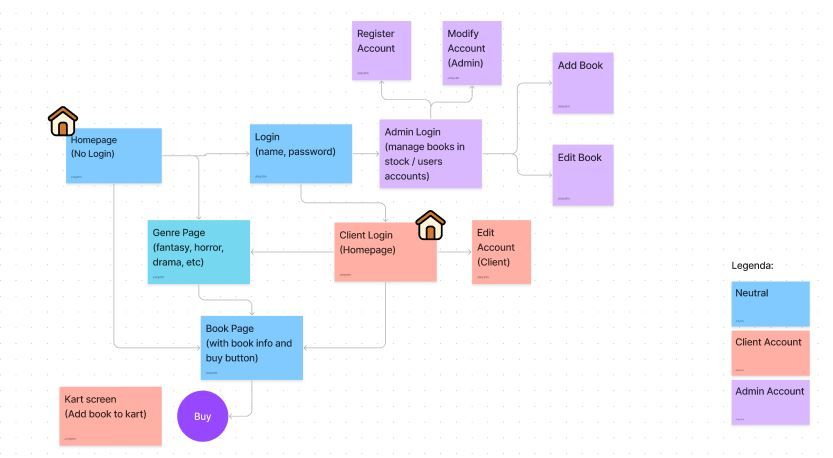

# Project Report - Book Store

Made by: 
-	Jônatas Alves Lopes - N°: 11796552 
-	Pedro Raymundi - N°: 11795634 

# Requirements

- A loja consiste em uma livraria virtual, com foco na venda de livros. 
-   O sistema tem dois tipos de usuários: clientes e administradores
	-  Administradores podem gerenciar contas de outros administradores e de clientes e gerenciar o cadastro (CRUD) de livros. O sistema tem uma conta inicial de administrador com o username e senha "admin".
	- Clientes são os usuários que tem acesso ao sistema para comprar os livros.
-   Os dados do administrador são: name, id, phone, email.
-   Os dados do cliente são: name, id, address, phone, email
-   Os dados de um livro são: name, id, photo, author, description, price, quantity_in_stock, quantity_sold, stars_rate.
- Vendendo livros: Os livros são selecionados, é escolhida uma quantidade, e eles são incluídos no carrinho. Livros são comprados usando um número de cartão de crédito (qualquer numero é aceito pelo sistema). A quantidade de um produto vendido é subtraída da quantidade no estoque (quantity_in_stock) e adicionada na quantidade vendida (quantity_sold). Carrinhos só são esvaziados com o pagamento ou pelos clientes. 

# Project Description

-	O sistema possui uma homepage que exibe promoções, destaques da loja, alguns livros mais populares e de alguma categoria dentre as existentes no site.
Existe um botão "user" que permite ao usuário acessar as telas para entrar com uma conta existente, ou registrar no site. E também uma barra de pesquisa que permite ao cliente pesquisar por um livro do estoque.
-	Possui uma página que exibe os livros de uma determinada categoria (genero literário) disponivel no site. E uma página com as informações de um livro selecionado e a opção para comprá-lo (adicionar ao carrinho). A ideia é que o carrinho apareça como um overlay no canto superior direito da tela.
-	Com uma conta de admistrador, se tem acesso à uma página que permite gerenciar os livros no estoque e também à uma de gerenciamento dos usuários no site. 
-	(funcionalidade) Similares: Será mostrado livros similares ao selecionado pelo usuário
-	(mockups)
	- Mockup do website: https://www.figma.com/file/0fDviLw7DFfuNuaV6tuUFc/Site-Mockup?node-id=0%3A1;
		- https://www.figma.com/proto/0fDviLw7DFfuNuaV6tuUFc/Site-Mockup?node-id=2%3A2&scaling=scale-down&page-id=0%3A1&starting-point-node-id=2%3A2

	- Diagrama do website: https://www.figma.com/file/BkgTeQdphSKPElJ3EERYWc/Diagrama?node-id=0%3A1;
	- HTML/CSS: estão no repositório;
-	(informação salva) Serão salvos todos os dados dos administradores (name, id, address, phone, email), clientes (name, id, phone, email)  e livros (name, id, photo, author, description, price, genres, quantity_in_stock, quantity_sold).

# Comments About the Code
Nenhum.

# Test Plan
Testes manuais verificando cada página e suas funcionalidades, buscando encontrar erros e locais para melhora, não foi utilizada nenhuma ferramenta externa. Crie uma conta com o email "admin@email.com" para testar os comandos do admin

# Test Results
A maior parte dos erros persistentes são devidos à falta de um servidor para que possam ser salvos os dados.

# Build Procedures
É necessário ter o npm e node instalado 
-	https://www.npmjs.com/package/npm;
-	https://nodejs.org/en/download/;

Baixe os arquivos da pasta parte2React, vá até o diretório e use npm install e, por fim, inicie-os com npm start. 
(talvez seja necessário usar o yarn para as rotas yarn add react-router-dom@6)

Registre uma conta com o email "admin@email.com" para tre acesso à uma conta de admin

# Problems
Nenhum.
    
# Comments
Não tem tela finalizando a compra já que não vai existir tela para os dados do cartão.
Também não é possível alterar os dados dos produtos por parte do admin pq eles estão mockados em um .js
